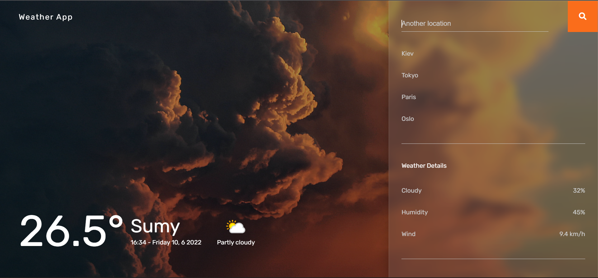

<div id="top"></div>

<!-- Project name -->

<br />
<div align="center">

<h1 align="center">Weather App</h1>

  <p align="center">
    <a href="https://denyska-h.github.io/Weather-App/">View Demo</a>
    ·
    <a href="https://github.com/Denyska-H/Weather-App/issues">Report Bug</a>
  </p>
</div>


<!-- About the project -->

## About The Project



This website presents information about the weather and climate for almost every city around the world.

<!-- Getting started -->

## Installation

1. Clone the repo
   ```sh
   git clone https://github.com/Denyska-H/Weather-App.git
   ```
2. Install NPM packages
   ```sh
   npm install (npm i)
   ```
3. Run gulp command
    ```sh
   gulp
   ```
4. Other gulp commands
 
	>npm run dev - do the same as gulp (run build in developer mode)

	>npm run build - run build in build mode

	>npm run zip - collects build into one archive


<!-- CONTACT -->

## Contact

Denys Hleba 

- [Instagram](https://www.instagram.com/denys.life9)
- [Telegram](https://t.me/realgemba)

Project Link: [Weather App](https://github.com/Denyska-H/Weather-App)

<p align="right">(<a href="#top">back to top</a>)</p>
